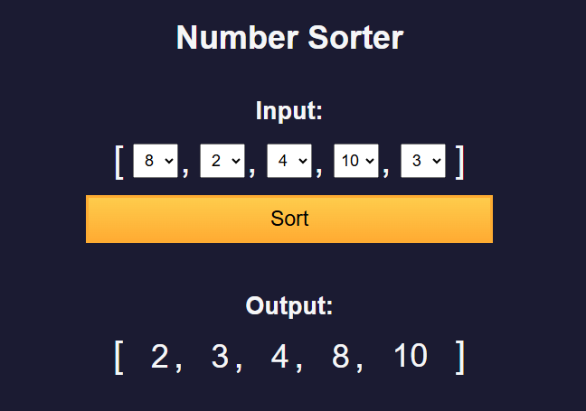

# Number Sorter

A simple web application that allows users to sort an array of numbers using various sorting algorithms, such as Bubble Sort, Selection Sort, and Insertion Sort.

## Features

- User-friendly dropdown menus to input numbers.
- Supports multiple sorting algorithms.
- Displays the sorted output dynamically.
- Responsive and accessible design.

## Technologies Used

- **HTML**: For the structure of the application.
- **CSS**: For styling and responsive design.
- **JavaScript**: For implementing sorting logic and updating the UI.

## How to Use

1. Clone the repository:

   <code>git clone https://github.com/Manusha-Nirmal-Perera/number-sorter.git</code>
   <code>cd number-sorter</code>

2. Open index.html in a browser.

3. Select numbers from the dropdowns and click the Sort button.

4. View the sorted numbers in the output section.

## Screenshot of the page

Below is a demo of the Number Soter in action:

